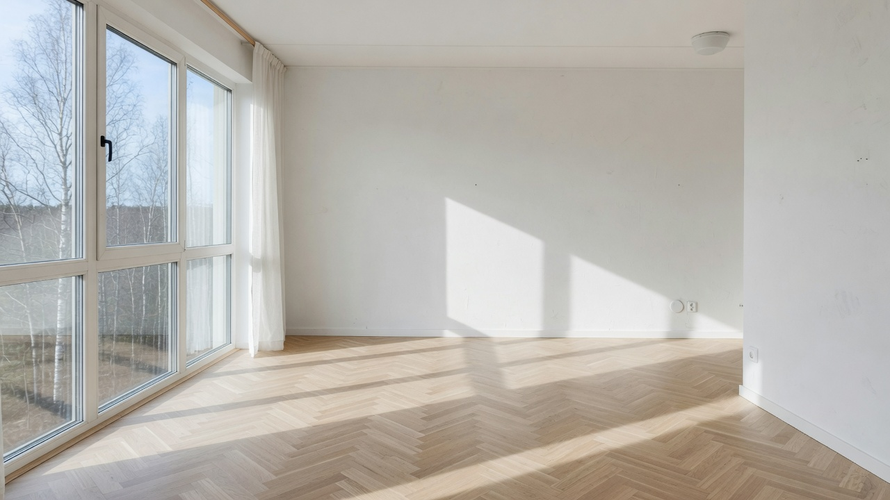
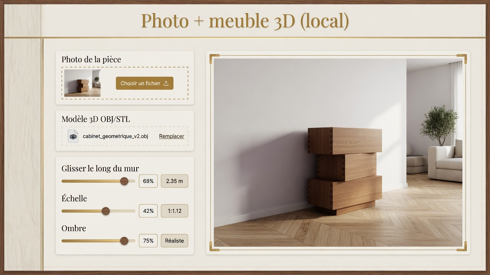
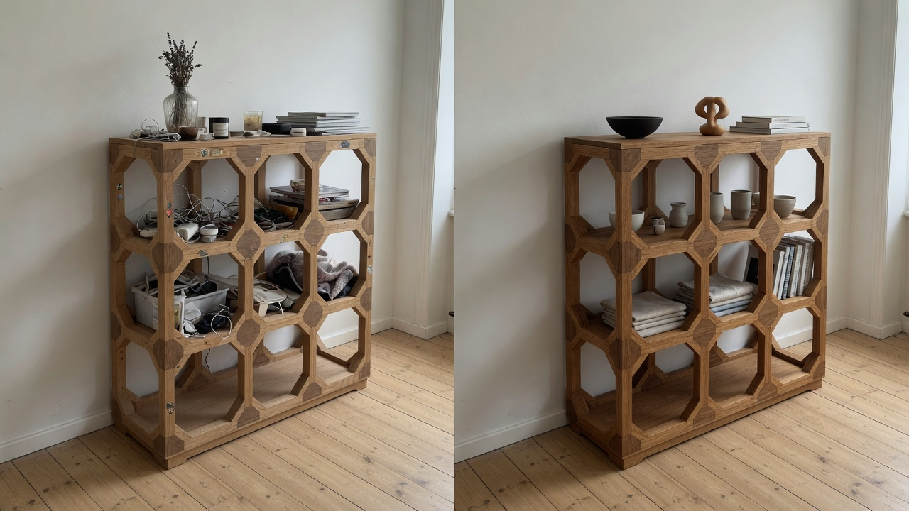

# Photo + meuble 3D (tout en local)

Vous donnez **une photo de pièce** et **un modèle 3D** (OBJ ou STL).  
Le programme reconstruit le sol et un mur, pose le meuble dessus à une échelle estimée, et vous laisse tout ajuster dans une fenêtre.

Aucun serveur distant au moment de l’utilisation, une fois les poids téléchargés.

---

## Ce que vous allez voir

### 1. Photo de départ

Une pièce avec un sol et un mur bien visibles.



### 2. Interface après lancement

Le navigateur s’ouvre tout seul sur `http://127.0.0.1:7860`.



À gauche : imports + curseurs. À droite : la photo avec le meuble déjà posé.

### 3. Rendu interactif

Le meuble est collé au sol et au mur. Vous le glissez, le tournez, changez l’échelle. L’ombre et la lumière se mettent à jour en direct.



---

## Installation de Python (une fois)

1. Allez sur [python.org/downloads](https://www.python.org/downloads/).
2. Installez **Python 3.10 ou plus**.
3. **Cochez** « Add python.exe to PATH ».
4. Ouvrez un terminal et tapez :

```text
python --version
```

Vous devez lire quelque chose comme `Python 3.12.x`.  
Si Windows répond « python introuvable », fermez le terminal, rouvrez-le, ou réinstallez Python en cochant le PATH.

---

## Premier lancement

Dans l’Explorateur Windows, allez dans le dossier `photo-meuble`.

**Le plus simple (Windows)** : double-clic sur `lancer.bat`.

- Premier clic : installation des bibliothèques **et** téléchargement des poids (plusieurs minutes, internet obligatoire **cette fois-là seulement**).
- Clics suivants : ouverture directe de l’interface.

**À la main** :

```text
cd photo-meuble
python installer.py
python lancer.py
```

Le navigateur s’ouvre. Vous n’avez plus besoin de la ligne de commande.

---

## Comment s’en servir

| Étape | Action | Résultat attendu |
| --- | --- | --- |
| Photo | Bouton « Photo de la pièce » | Un message « Scène prête » (ou un avertissement sol) |
| Modèle | Bouton « Modèle 3D » (`.obj` / `.stl`) | Le meuble apparaît déjà posé, à l’échelle auto |
| Placement | Curseurs, ou **clic dans l’image** | Le meuble glisse le long du mur |
| Échelle | Curseur, ou « Recalculer l’échelle » | Nouvelle proposition si le premier essai est faux |
| Rendu | Ombre, reflets, lumière, teinte | Mise à jour en direct sur **la même** photo |
| Qualité | Résolution profondeur / qualité 3D | Plus net, un peu plus lent |

Le meuble **ne flotte pas** : il reste sur le plan du sol.  
Il **ne traverse pas le mur** : il est plaqué sur le plan vertical détecté.

---

## Sauvegarder un bon réglage

- **Sauvegarder la configuration** → fichier JSON dans `configs/`.
- **Charger une configuration** → on reprend les curseurs sans tout redéfinir.
- **Exporter les valeurs figées** → écrit `pipeline/valeurs_figees.py` (réglage « production » au prochain lancement).

Exemple fourni : `configs/exemple.json`.

---

## Si une étape échoue

| Symptôme | Que faire |
| --- | --- |
| « Python n’est pas dans le PATH » | Réinstaller Python 3.10+ en cochant Add to PATH, rouvrir le terminal |
| `pip` échoue pendant `installer.py` | Vérifier internet. Relancer `python installer.py` |
| Téléchargement des poids bloqué | Même chose : le premier téléchargement a besoin du réseau. Ensuite, c’est hors-ligne |
| Message *détection du sol a échoué* | Recadrez : sol bien visible en bas, mur bien visible, photo droite. Un plan horizontal de secours est déjà utilisé |
| Meuble trop grand / trop petit | Curseur **Redimensionner**, ou bouton **Recalculer l’échelle** |
| Meuble dans le mur | Augmentez **Éloignement du mur** |
| Rendu lent | Qualité 3D = `basse`, résolution profondeur = 256 |
| Page Gradio blanche | Attendez le premier calcul (profondeur + segmentation). Regardez le terminal |

---

## Architecture (une fonction par étape)

```
photo-meuble/
  installer.py          vérifie Python, pip, poids
  lancer.py             ouvre Gradio
  lancer.bat            double-clic Windows
  app.py                interface
  pipeline/
    profondeur.py       Depth Anything V2 Small
    plans.py            sol RANSAC + murs ADE20K
    camera.py           focale + échelle métrique
    maillage.py         OBJ/STL → mètres
    contraintes.py      rails sol / mur
    rendu.py            projection + ombre + lumière
    etat.py             enchaîne les étapes
    config.py           JSON + valeurs figées
```

Les poids vivent dans `poids/` (cache Hugging Face).  
Après le premier téléchargement : **zéro appel réseau**.

La segmentation des murs utilise **SegFormer-B0 sur ADE20K** (150 classes, dont `wall` et `floor`) : même jeu d’étiquettes que DeepLabV3-ADE20K, plus léger à installer. `segment-anything` est dans `requirements.txt` mais n’est **pas chargé** au démarrage (poids trop lourds).

---

## Dépendances

Voir `requirements.txt` : `torch`, `torchvision`, `transformers`, `trimesh`, `open3d`, `segment-anything`, `gradio`, `opencv-python`, `numpy`, `pillow`.
